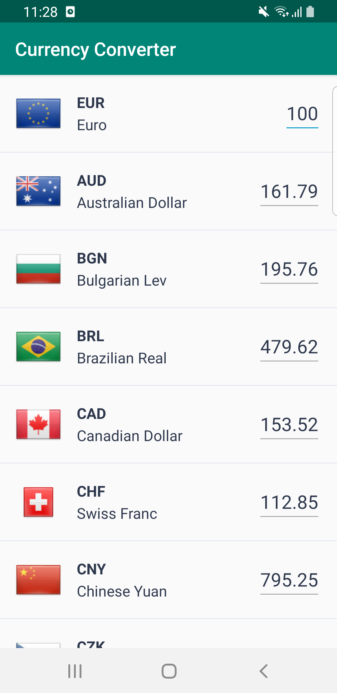
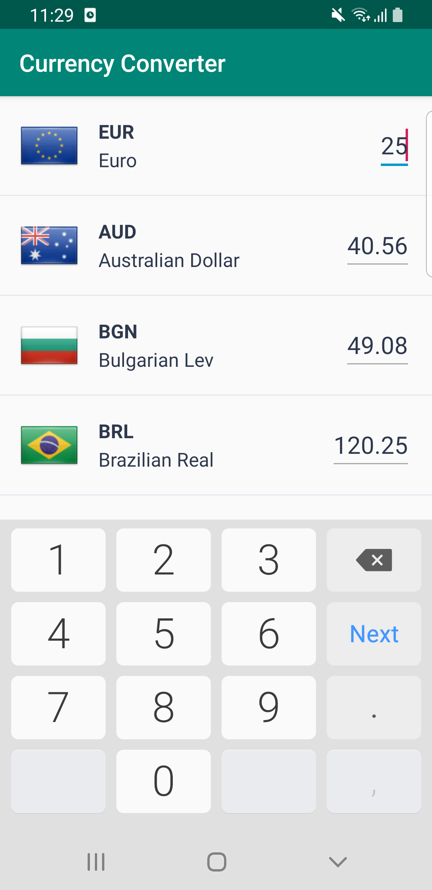
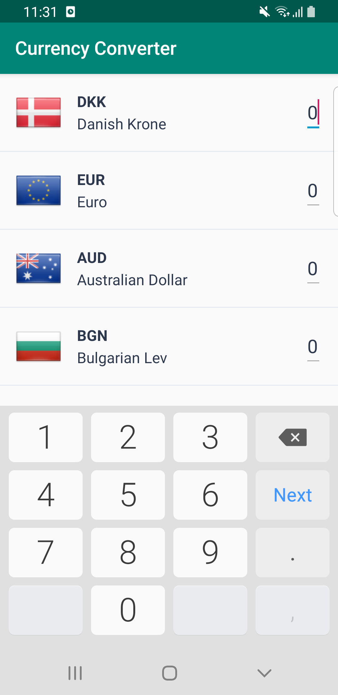
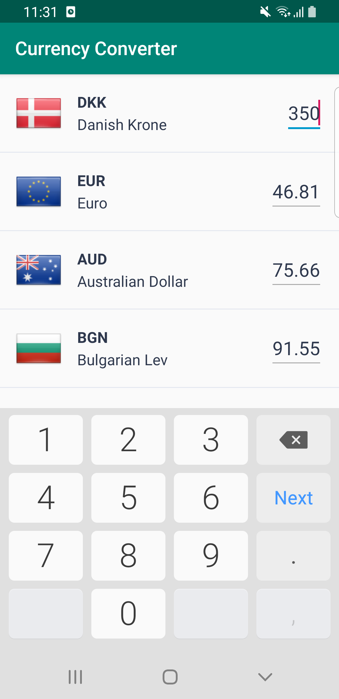

# Currency Converter

Theory without practice is empty, practice without theory is blind.

## Screenshots
&nbsp;
&nbsp;
&nbsp;

## Common Dependencies
- Kotlin, MVVM, Androidx, Architecture Components, Retrofit2

## Branches
- [coroutines-livedata](https://github.com/kikyoungkwon/currency-converter/tree/coroutines-livedata): Koin, Coroutines, LiveData, mockk
- [rxjava](https://github.com/kikyoungkwon/currency-converter/tree/rxjava): Koin, Rxjava2, mockk
- [coroutines-channel](https://github.com/kikyoungkwon/currency-converter/tree/coroutines-channel): Koin, Coroutines, Channel, mockk

## TODO
- Modular approach